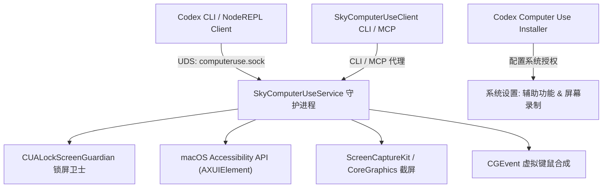

# macOS 原生层守护进程架构剖析 (SkyComputerUseService)

OpenAI Codex Computer Use 在 macOS 系统上的核心执行体位于 `~/.codex/computer-use/Codex Computer Use.app`。

## 一、 组件组成与架构拓扑



### 1. `SkyComputerUseService` (主守护进程)
- **Bundle ID**: `com.openai.sky.CUAService`
- **App Group**: `2DC432GLL2.com.openai.sky.CUAService`
- **主要职责**:
  1. 监听 UNIX Domain Socket (`computeruse.sock`)。
  2. 实现 JSON-RPC 2.0 服务端。
  3. 通过 macOS 辅助功能树 (`AXUIElementCopyAttributeValue`, `AXUIElementPerformAction`) 构建 UI 层级。
  4. 截取应用窗口画面（优先使用 `ScreenCaptureKit`，兼容 `CGWindowListCreateImage`）。
  5. 过滤敏感数据并支持“增量差异树 (Tree Diffing)”计算。
  6. 模拟键鼠交互事件 (`CGEventCreateMouseEvent`, `CGEventCreateKeyboardEvent`, `CGEventPost`)。

### 2. `SkyComputerUseClient.app` (客户端 / MCP 桥接器)
- **Bundle ID**: `com.openai.sky.CUAService.cli`
- **运行模式**:
  - `SkyComputerUseClient mcp`：作为 MCP (Model Context Protocol) 服务的实现，供外部 Agent 工具链调用。
  - `SkyComputerUseClient turn-ended`：向宿主通知当前推理轮次结束，触发系统资源释放。

### 3. `CUALockScreenGuardian.app` (安全守卫)
- 监听系统锁屏通知（`com.apple.screenIsLocked`）。
- 一旦用户离开电脑或屏幕锁定，立即阻断所有自动化操作，防止被他人恶意借用。

### 4. `Codex Computer Use Installer.app`
- 包含辅助提权工具：
  - `CodexComputerUseAuthorizationPluginInstallerTool`
  - `CodexComputerUseAuthorizationPlugin.bundle`
- 自动检测并引导用户授予 **辅助功能 (Accessibility)** 与 **屏幕录制 (Screen Recording)** 权限。

---

## 二、 编译与工程依赖 (基于提取的 BUILD.bazel)

通过分析提取自 `Codex Computer Use.app/Contents/Resources/BUILD.bazel` 的内容：

```python
swift_library(
    name = "CUAServiceSources",
    srcs = glob(["*.swift"]),
    copts = ["-swift-version", "5"],
    data = [":Assets.xcassets"],
    module_name = "CUAService",
    deps = [
        ":AppConstants",
        "@cua_package//:ComputerUse",
        "@cua_package//:ComputerUseClient",
        "@cua_package//:Fog",
        "@cua_package//:GraphicsSupport",
        "@cua_package//:Logging",
        "@cua_package//:SlimCore",
        "@swiftpkg_oaiprotobuf//:OAIProtobuf",
        "@swiftpkg_oaistatsig//:OAIStatsig",
        "@swiftpkg_sparkle//:Sparkle",
        "@swiftpkg_swift_protobuf//:SwiftProtobuf",
    ],
)
```

关键内部模块揭秘：
- `ComputerUse`: 核心交互引擎与 AX 树抓取逻辑。
- `GraphicsSupport`: 屏幕捕获与图像压缩流水线。
- `Fog`: 内部网络/日志通信支持。
- `SlimCore`: 基础架构运行核心。
- `OAIProtobuf`: 内部序列化协议。
